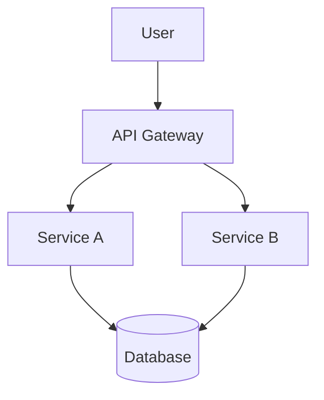

## Prerequisites

Before running this command, verify the following are available:

1. **gcloud**: Run `which gcloud`. If missing, install via `brew install --cask google-cloud-sdk`
2. **gcloud auth (documents/drive scopes)**: Run `gcloud auth application-default print-access-token`. If missing or expired, run:
   ```
   gcloud auth application-default login \
     --scopes=https://www.googleapis.com/auth/documents,https://www.googleapis.com/auth/drive
   ```
3. **snow CLI** (optional, for deployment): Run `which snow`. If missing, install via `npm i -g @pmc/snow-cli`

If any prerequisite is missing, walk the user through setting it up before proceeding.

# Bet Brief Skill

Generate a product docs viewer (bet brief) for an active bet and optionally deploy to Snow.

## Overview

A bet brief is a static HTML site that renders the bet's markdown files in a polished UI with:
- Spotify dark theme with green accents
- Sidebar navigation grouped by category
- Welcome screen with key metrics
- Markdown rendering via marked.js
- **Mermaid diagram rendering** (flowcharts, sequence diagrams, etc.)
- Links to Jira, Groove, and external docs

**Related:** Presentations (HTML or markdown files) should be stored alongside the bet in the same directory (e.g., `domains/[domain]/01_active_bets/[bet-name]/presentation.html`). Export to Google Slides (`/export-slides`) or PowerPoint (`/export-pptx`) as needed.

## Usage

```
/brief domains/adjustments/01_active_bets/self-serve adjustments
/brief domains/adjustments/01_active_bets/self-serve adjustments --deploy
```

## Arguments

- `<bet-path>`: Path to the bet directory (required)
- `--deploy`: Deploy to Snow after generating (optional)

---

## Instructions

### Step 1: Validate Bet Directory

Check that the path is a valid bet directory with standard files:

```bash
BET_PATH="$1"
ls "$BET_PATH"/*.md 2>/dev/null | head -5
```

Expected files: `status.md`, `problem_frame.md`, `hypothesis.md`, `evidence.md`, `decision_log.md`, `prd.md`

If no markdown files found, tell the user:
```
No markdown files found in [path]. Is this a valid bet directory?
```

---

### Step 2: Read Bet Metadata

Read the status.md to extract:
- Bet name (from `# Status: [Name]` heading)
- Jira ticket (from `**Jira Ticket:**` line)
- Groove Initiative (from `**Groove Initiative:**` line)
- Current phase (from `**Phase:**` line)

---

### Step 3: Check for Existing index.html

```bash
if [ -f "$BET_PATH/index.html" ]; then
    echo "EXISTS"
else
    echo "NEW"
fi
```

If EXISTS, ask the user:
```
An index.html already exists. Do you want to:
1. Regenerate it (overwrites existing)
2. Just deploy the existing one to Snow
3. Cancel
```

---

### Step 4: Copy Shared Assets

Copy the shared CSS and JS files from the plugin into the bet directory:

```bash
# Find the bet-docs plugin assets directory
ASSETS_DIR=""
for candidate in \
  ".claude/plugins/bet-docs/assets" \
  "$HOME/.claude/plugins/local/bet-docs/assets"; do
  if [ -d "$candidate" ]; then
    ASSETS_DIR="$(cd "$candidate" && pwd)"
    break
  fi
done

# Copy shared assets into bet directory
cp "$ASSETS_DIR/bet-brief.css" "$BET_PATH/"
cp "$ASSETS_DIR/bet-brief.js" "$BET_PATH/"
```

If the assets directory is not found, tell the user:
```
Could not find the bet-docs plugin assets directory.
Expected at: .claude/plugins/bet-docs/assets/
```

### Step 5: Generate index.html

Create the bet brief HTML using local asset references:

**Template structure:**

```html
<!DOCTYPE html>
<html lang="en">
<head>
    <meta charset="UTF-8" />
    <meta name="viewport" content="width=device-width, initial-scale=1.0" />
    <title>[BET_NAME] | Product Docs</title>
    <link rel="preconnect" href="https://fonts.googleapis.com">
    <link rel="preconnect" href="https://fonts.gstatic.com" crossorigin>
    <link href="https://fonts.googleapis.com/css2?family=Inter:wght@400;500;600;700&display=swap" rel="stylesheet">
    <link rel="stylesheet" href="bet-brief.css">
    <script src="https://cdn.jsdelivr.net/npm/marked@9.1.6/marked.min.js"></script>
    <script src="https://cdn.jsdelivr.net/npm/mermaid@10/dist/mermaid.min.js"></script>
    <script src="bet-brief.js"></script>
</head>
<body>
    <nav class="sidebar">
        <div class="sidebar-header">
            <a class="home-link" onclick="BetBrief.showWelcome(); return false;">[BET_NAME]</a>
            <div class="bet-title">[DOMAIN_NAME]</div>
        </div>

        <div class="section-title">Core Documents</div>
        <ul id="core-docs" class="doc-list"></ul>

        <div class="section-title">Progress & Tracking</div>
        <ul id="tracking-docs" class="doc-list"></ul>

        <div class="section-title">Reference</div>
        <ul id="reference-docs" class="doc-list"></ul>

        <div class="status-section">
            <div class="status-label">Current Phase</div>
            <div class="status-value">[PHASE]</div>
            <div class="links-section">
                <a href="[JIRA_URL]" target="_blank" class="external-link">
                    <span>Jira: [JIRA_KEY]</span>
                </a>
                <a href="[GROOVE_URL]" target="_blank" class="external-link">
                    <span>Groove: [GROOVE_ID]</span>
                </a>
            </div>
        </div>
    </nav>

    <main class="main-content comments-hidden" id="main-content">
        <div id="welcome-content" class="welcome-screen active">
            <div class="welcome-icon">&#128203;</div>
            <h1 class="welcome-message">[BET_NAME]</h1>
            <p class="welcome-subtitle">[BET_DESCRIPTION]</p>
        </div>

        <div id="doc-content" class="doc-container">
            <div class="doc-header">
                <div class="doc-breadcrumb">
                    [BET_NAME] <span>/</span> <span id="doc-category">Document</span>
                </div>
                <button class="comments-toggle" id="comments-toggle" onclick="BetBrief.toggleComments()">
                    <span>&#128172;</span>
                    <span>Comments</span>
                    <span class="comments-toggle-count" id="comments-toggle-count">0</span>
                </button>
            </div>
            <div id="markdown-content" class="markdown-body"></div>
        </div>
    </main>

    <aside class="comments-panel hidden" id="comments-panel">
        <div class="comments-panel-header">
            <div class="comments-panel-title">
                <span>&#128172;</span>
                Comments
                <span class="comments-panel-count" id="comments-count">0</span>
            </div>
            <button class="comments-panel-close" onclick="BetBrief.toggleComments()">&times;</button>
        </div>
        <div class="comments-panel-body" id="comments-panel-body">
        </div>
        <div class="comments-panel-footer">
            <div class="comment-section-label" id="comment-section-label">
                Commenting on: <strong id="current-section-name">Document</strong>
            </div>
            <div class="comment-form">
                <textarea
                    id="comment-input"
                    placeholder="Add a comment..."
                    maxlength="2000"
                ></textarea>
                <div class="comment-form-actions">
                    <button type="button" class="btn btn-primary" id="submit-comment" onclick="BetBrief.submitComment()">
                        Post
                    </button>
                </div>
            </div>
        </div>
    </aside>

    <script>
        const documents = {
            core: [
                { id: 'problem_frame', title: 'Problem Frame', icon: '&#127919;', file: 'problem_frame.md' },
                { id: 'hypothesis', title: 'Hypothesis', icon: '&#128161;', file: 'hypothesis.md' },
                { id: 'evidence', title: 'Evidence', icon: '&#128269;', file: 'evidence.md' },
                { id: 'prd', title: 'PRD', icon: '&#128196;', file: 'prd.md' }
            ],
            tracking: [
                { id: 'status', title: 'Status', icon: '&#128200;', file: 'status.md' },
                { id: 'decision_log', title: 'Decision Log', icon: '&#128221;', file: 'decision_log.md' }
            ],
            reference: []
        };
        BetBrief.init({ betName: '[BET_NAME]', documents });
    </script>
</body>
</html>
```

**Customization:**
- Replace `[BET_NAME]` with the bet name from status.md
- Replace `[DOMAIN_NAME]` with the domain (e.g., "Adjustments Domain")
- Replace `[PHASE]` with current phase
- Replace `[JIRA_URL]`, `[JIRA_KEY]`, `[GROOVE_URL]`, `[GROOVE_ID]` with actual values
- Replace `[BET_DESCRIPTION]` with the description from status.md
- Add any additional markdown files found to the `reference` array

---

### Step 6: Deploy to Snow (if --deploy)

If the `--deploy` flag was provided:

```bash
# Derive site name from bet folder
SITE_NAME=$(basename "$BET_PATH" | tr '[:upper:]' '[:lower:]' | tr ' ' '-' | sed 's/[^a-z0-9-]//g')

# Deploy to Snow
snow deploy -n "$SITE_NAME" -b "$BET_PATH" --no-build -y
```

**Important:** Snow cannot access files outside the deployed directory. If the bet references external files, they must be copied into the bet directory first.

---

### Step 7: Update status.md with Snow Site

After successful deployment, update the bet's status.md to include the Snow site:

```markdown
**Snow Site:** [site-name]
```

Add this after the Groove links if not already present.

---

### Step 8: Report Success

```
Bet brief generated successfully!

**[BET_NAME]**
- index.html: [BET_PATH]/index.html
- Snow URL: https://snow.spotify.net/s/[SITE_NAME]

The brief renders your bet's markdown files in a polished docs viewer.
```

---

## Mermaid Diagram Support

Bet briefs automatically render Mermaid diagrams in markdown files. Use standard Mermaid code blocks:

````markdown
## Architecture Overview


````

**Supported diagram types:**
- Flowcharts (`graph TD`, `graph LR`)
- Sequence diagrams (`sequenceDiagram`)
- Class diagrams (`classDiagram`)
- State diagrams (`stateDiagram-v2`)
- Entity Relationship diagrams (`erDiagram`)
- Gantt charts (`gantt`)
- Pie charts (`pie`)

The diagrams are rendered client-side using Mermaid.js with a dark theme that matches the Spotify aesthetic.

**Configuration:** Mermaid is initialized with:
```javascript
mermaid.initialize({
    startOnLoad: false,
    theme: 'dark',
    themeVariables: {
        primaryColor: '#1DB954',
        primaryTextColor: '#fff',
        primaryBorderColor: '#1DB954',
        lineColor: '#b3b3b3',
        secondaryColor: '#282828',
        tertiaryColor: '#121212'
    }
});
```

---

## Reference Implementations

See these existing bet briefs for examples:
- `domains/adjustments/01_active_bets/self-serve adjustments/index.html`
- `domains/booking/01_active_bets/Subledger/index.html`

---

## Troubleshooting

**Snow deploy fails:**
- Ensure you're on VPN
- Check that `snow` CLI is installed (`npm install -g @pmc/snow-cli`)
- Verify the bet directory contains an index.html

**Markdown not rendering:**
- Check that markdown files are in the same directory as index.html
- Verify file names match the `documents` configuration in the HTML

**Shared assets not loading:**
- The shared CSS/JS (`bet-brief.css`, `bet-brief.js`) should be in the bet directory alongside `index.html`
- If missing, re-run `/brief` to copy them from the plugin's assets directory
