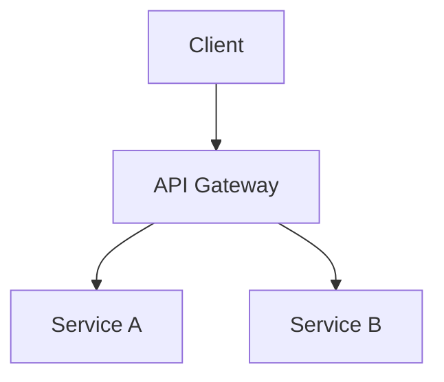

## Prerequisites

Before running this command, verify the following are available:

1. **gcloud**: Run `which gcloud`. If missing, install via `brew install --cask google-cloud-sdk`
2. **node**: Run `which node`. If missing, install via `brew install node`
3. **python3**: Run `which python3`. If missing, install via `brew install python3`
4. **gcloud auth (presentations/drive/cloud-platform scopes)**: Run `gcloud auth application-default print-access-token`. If missing or expired, run:
   ```
   gcloud auth application-default login \
     --scopes=https://www.googleapis.com/auth/presentations,https://www.googleapis.com/auth/drive,https://www.googleapis.com/auth/cloud-platform
   ```

If any prerequisite is missing, walk the user through setting it up before proceeding.

# Google Slides Export Skill

Export HTML presentations or Markdown files to Google Slides.

## Overview

This skill creates Google Slides presentations from:
- **HTML presentations**: Converts `.slide` elements to slides
- **Markdown files**: Converts headers to slide titles, content to bullets
- **Mermaid diagrams**: Renders diagrams as images and embeds them

## Usage

```
/export-slides domains/booking/Subledger/presentation.html
/export-slides domains/product-tooling/ai-augmented-discovery/prd.md
/export-slides domains/booking/my-bet/index.html --title="Kickoff Presentation"
```

**Important:** Store presentations alongside their related bet directories (e.g., `domains/[domain]/[bet-name]/presentation.html`).

## Arguments

- `<file>`: Path to HTML presentation or Markdown file (required)
- `--title=<name>`: Presentation title (optional, defaults to filename)

## Output

Creates a Google Slides presentation in the user's Drive and returns the URL.

---

## Instructions

### Step 1: Detect File Type and Parse Arguments

```bash
FILE_PATH="$1"
TITLE_ARG="${2:-}"

# Extract title from argument if provided
if [[ "$TITLE_ARG" == --title=* ]]; then
    TITLE="${TITLE_ARG#--title=}"
else
    # Default to filename without extension
    TITLE=$(basename "$FILE_PATH" | sed 's/\.[^.]*$//' | tr '_-' ' ')
fi

# Check file exists
if [ ! -f "$FILE_PATH" ]; then
    echo "NOT_FOUND"
    exit 1
fi

# Detect file type
case "$FILE_PATH" in
    *.html) echo "TYPE=html" ;;
    *.md)   echo "TYPE=markdown" ;;
    *)      echo "TYPE=unknown" ;;
esac
```

If NOT_FOUND, tell the user the file doesn't exist.
If TYPE=unknown, tell the user only .html and .md files are supported.

---

### Step 1b: Choose Export Mode (HTML files only)

For HTML presentation files, ask the user which export mode to use via AskUserQuestion:

- **Image mode (Recommended)** — Screenshots each slide at 2x retina resolution using Playwright and inserts as full-bleed images. Visually identical to the HTML. Not editable in Google Slides.
- **Text mode** — Extracts text content from slides and creates structured Google Slides with native text boxes, titles, and bullets. Editable but loses custom styling, layout, colours, and visual design.

For Markdown files, always use **text mode** (image mode is not applicable).

If the user chooses **image mode**, follow the image export path (Step 3-IMG through Step 6-IMG below).
If the user chooses **text mode**, follow the text export path (Step 3 through Step 8 below).

---

### Step 2: Check Authentication and Scopes

Verify Google Slides API access **and** that the token has the required scopes:

```bash
# Step 2a: Check if a token can be obtained at all
TOKEN=$(gcloud auth application-default print-access-token 2>/dev/null)
if [ -z "$TOKEN" ]; then
    echo "AUTH_MISSING"
fi
```

If AUTH_MISSING, run the auth command directly (do NOT ask the user to paste it — zsh line breaks cause scope arguments to be dropped):

```bash
gcloud auth application-default login --scopes=https://www.googleapis.com/auth/presentations,https://www.googleapis.com/auth/drive,https://www.googleapis.com/auth/cloud-platform
```

```bash
# Step 2b: Verify the token has presentations and drive scopes
SCOPES=$(curl -s "https://www.googleapis.com/oauth2/v1/tokeninfo?access_token=$TOKEN" | python3 -c "import sys,json; print(json.load(sys.stdin).get('scope',''))")

if [[ "$SCOPES" != *"presentations"* ]] || [[ "$SCOPES" != *"drive"* ]]; then
    echo "SCOPES_MISSING"
fi
```

If SCOPES_MISSING, the token exists but lacks the `presentations` and/or `drive` scopes. Re-authenticate by running the gcloud command directly via Bash (not asking the user to paste):

```bash
gcloud auth application-default login --scopes=https://www.googleapis.com/auth/presentations,https://www.googleapis.com/auth/drive,https://www.googleapis.com/auth/cloud-platform
```

**Important:** Always run this command via the Bash tool — do NOT ask the user to copy-paste it. Zsh terminals split multi-line pastes and silently drop the `--scopes` argument, resulting in tokens without the required scopes.

After re-auth, fetch a fresh token:
```bash
TOKEN=$(gcloud auth application-default print-access-token)
```

---

---

## Image Export Path (HTML only)

Follow these steps when the user chooses **image mode**. Skip to "Text Export Path" below if the user chose text mode.

### Step 3-IMG: Screenshot Slides with Playwright

Write a temporary Node.js script (`.tmp-screenshot-slides.mjs`) that uses Playwright to capture each slide:

```javascript
import { chromium } from 'playwright';
import { mkdirSync } from 'fs';
import { resolve } from 'path';

const htmlPath = resolve('<FILE_PATH>');
const outDir = resolve('.tmp-slide-images');
mkdirSync(outDir, { recursive: true });

const browser = await chromium.launch({ headless: true });
const context = await browser.newContext({
  viewport: { width: 1920, height: 1080 },
  deviceScaleFactor: 2,
});
const page = await context.newPage();

await page.goto(`file://${htmlPath}`, { waitUntil: 'networkidle' });
await page.waitForFunction(() => document.fonts.ready);
await page.waitForTimeout(1000);

const slideCount = await page.evaluate(() => document.querySelectorAll('.slide').length);
console.log(`Found ${slideCount} slides`);

for (let i = 0; i < slideCount; i++) {
  await page.evaluate((idx) => goToSlide(idx), i);
  await page.waitForTimeout(1200); // wait for CSS transition

  // Hide navigation chrome
  await page.evaluate(() => {
    const hide = (id) => { const el = document.getElementById(id); if (el) el.style.display = 'none'; };
    hide('nav'); hide('progress'); hide('help');
  });
  await page.waitForTimeout(100);

  await page.screenshot({ path: `${outDir}/slide_${i + 1}.png`, type: 'png' });
  console.log(`Saved slide ${i + 1}`);

  // Restore nav
  await page.evaluate(() => {
    const show = (id) => { const el = document.getElementById(id); if (el) el.style.display = ''; };
    show('nav'); show('progress'); show('help');
  });
}

await browser.close();
console.log('Done!');
```

Run it:

```bash
node .tmp-screenshot-slides.mjs
```

If Playwright is not importable, install it first:

```bash
npm install --no-save playwright
```

**Important:** The script uses `goToSlide()` which is defined in our HTML presentation template. If the HTML uses a different navigation function, adapt accordingly.

---

### Step 4-IMG: Create Presentation with Blank Slides

```bash
TOKEN=$(gcloud auth application-default print-access-token)

# Create empty presentation
RESPONSE=$(curl -s -X POST \
  -H "Authorization: Bearer $TOKEN" \
  -H "Content-Type: application/json" \
  -H "x-goog-user-project: fine-pm-em-staff" \
  -d "{\"title\": \"$TITLE\"}" \
  "https://slides.googleapis.com/v1/presentations")

# Extract presentation ID and default slide ID
PRES_ID=$(echo "$RESPONSE" | python3 -c "import sys,json; print(json.load(sys.stdin)['presentationId'])")
```

Then create N-1 additional blank slides (slide 1 already exists as `p`) and delete the default placeholder elements from the first slide:

```bash
# Create blank slides for slides 2..N
# Build requests array with createSlide for each

# Delete default placeholder text boxes from first slide
curl -s -X POST \
  -H "Authorization: Bearer $TOKEN" \
  -H "Content-Type: application/json" \
  -H "x-goog-user-project: fine-pm-em-staff" \
  -d '{"requests":[{"deleteObject":{"objectId":"i0"}},{"deleteObject":{"objectId":"i1"}}]}' \
  "https://slides.googleapis.com/v1/presentations/$PRES_ID:batchUpdate"
```

---

### Step 5-IMG: Upload Images to Drive and Insert into Slides

For each slide image:

1. **Upload to Drive** using multipart upload:

```bash
UPLOAD_RESP=$(curl -s -X POST \
  -H "Authorization: Bearer $TOKEN" \
  -H "x-goog-user-project: fine-pm-em-staff" \
  -F "metadata={\"name\":\"slide_${i}.png\",\"mimeType\":\"image/png\"};type=application/json" \
  -F "file=@${IMG_PATH};type=image/png" \
  "https://www.googleapis.com/upload/drive/v3/files?uploadType=multipart&fields=id")

FILE_ID=$(echo "$UPLOAD_RESP" | python3 -c "import sys,json; print(json.load(sys.stdin)['id'])")
```

2. **Set permissions** so the Slides API can access the image:

```bash
curl -s -X POST \
  -H "Authorization: Bearer $TOKEN" \
  -H "Content-Type: application/json" \
  -H "x-goog-user-project: fine-pm-em-staff" \
  -d '{"role":"reader","type":"anyone"}' \
  "https://www.googleapis.com/drive/v3/files/$FILE_ID/permissions"
```

3. **Insert as full-bleed image** into the slide. Use `https://lh3.googleusercontent.com/d/<FILE_ID>` as the image URL. Size should fill the entire slide (9144000 x 5143500 EMU):

```bash
{
  "createImage": {
    "url": "https://lh3.googleusercontent.com/d/<FILE_ID>",
    "elementProperties": {
      "pageObjectId": "<SLIDE_ID>",
      "size": {
        "width": {"magnitude": 9144000, "unit": "EMU"},
        "height": {"magnitude": 5143500, "unit": "EMU"}
      },
      "transform": {
        "scaleX": 1, "scaleY": 1,
        "translateX": 0, "translateY": 0,
        "unit": "EMU"
      }
    }
  }
}
```

Batch all image insertions into a single batchUpdate call for efficiency.

---

### Step 6-IMG: Clean Up and Report Success

```bash
rm -rf .tmp-slide-images .tmp-screenshot-slides.mjs
```

Report to user:

```
Google Slides presentation created!

**Title:** [TITLE]
**Slides:** [COUNT] slides (image mode — pixel-perfect)
**URL:** https://docs.google.com/presentation/d/[PRESENTATION_ID]/edit

Each slide is a 2x retina screenshot of the original HTML.
Note: Slides are not editable as text — edit the source HTML and re-export to update.
```

---

## Text Export Path (Markdown files, or HTML when user chooses text mode)

Follow these steps when the user chooses **text mode**, or when exporting a Markdown file.

### Step 3: Extract Content

**For HTML presentations:**

Read the file and extract slide content. Look for elements with class `.slide`:

```bash
# Count slides
grep -c 'class="slide"' "$FILE_PATH" || echo "0"
```

Parse each slide to extract:
- Title (first h1/h2 in the slide)
- Body content (paragraphs, lists)
- Images (img src attributes)
- Mermaid diagrams (elements with class `.mermaid` or code blocks with ```mermaid)

**For Markdown files:**

Parse the markdown structure:
- `#` or `##` headers become slide titles
- Content between headers becomes slide body
- Code blocks with ```mermaid become diagrams
- Bullet lists become slide bullets

---

### Step 4: Render Mermaid Diagrams (if present)

If the content contains Mermaid diagrams, render them to PNG:

```bash
# Create temp directory for diagrams
TEMP_DIR=$(mktemp -d)

# For each mermaid block, create a .mmd file and render
cat > "$TEMP_DIR/diagram_1.mmd" << 'EOF'
<mermaid content here>
EOF

# Render using mermaid-cli (mmdc)
npx -y @mermaid-js/mermaid-cli mmdc -i "$TEMP_DIR/diagram_1.mmd" -o "$TEMP_DIR/diagram_1.png" -b transparent
```

If mermaid-cli fails, tell the user:
```
Mermaid diagram rendering requires mermaid-cli. Install with:
npm install -g @mermaid-js/mermaid-cli
```

---

### Step 5: Create Google Slides Presentation

Get access token and create the presentation:

```bash
TOKEN=$(gcloud auth application-default print-access-token)

# Create empty presentation
curl -s -X POST \
  -H "Authorization: Bearer $TOKEN" \
  -H "Content-Type: application/json" \
  -H "x-goog-user-project: fine-pm-em-staff" \
  -d "{\"title\": \"$TITLE\"}" \
  "https://slides.googleapis.com/v1/presentations"
```

This returns a presentation ID. Save it for subsequent API calls.

---

### Step 6: Add Slides with Content

For each slide, use the batchUpdate API:

```bash
PRESENTATION_ID="<from step 5>"

# Add a new slide
curl -s -X POST \
  -H "Authorization: Bearer $TOKEN" \
  -H "Content-Type: application/json" \
  -H "x-goog-user-project: fine-pm-em-staff" \
  -d '{
    "requests": [
      {
        "createSlide": {
          "objectId": "slide_1",
          "slideLayoutReference": {
            "predefinedLayout": "TITLE_AND_BODY"
          }
        }
      }
    ]
  }' \
  "https://slides.googleapis.com/v1/presentations/$PRESENTATION_ID:batchUpdate"
```

Then insert text into the slide placeholders:

```bash
curl -s -X POST \
  -H "Authorization: Bearer $TOKEN" \
  -H "Content-Type: application/json" \
  -H "x-goog-user-project: fine-pm-em-staff" \
  -d '{
    "requests": [
      {
        "insertText": {
          "objectId": "slide_1_title",
          "text": "Slide Title Here"
        }
      },
      {
        "insertText": {
          "objectId": "slide_1_body",
          "text": "• Bullet point 1\n• Bullet point 2\n• Bullet point 3"
        }
      }
    ]
  }' \
  "https://slides.googleapis.com/v1/presentations/$PRESENTATION_ID:batchUpdate"
```

---

### Step 7: Upload and Insert Images

For Mermaid diagrams and other images:

**First, upload to Drive:**

```bash
IMAGE_PATH="$TEMP_DIR/diagram_1.png"

# Upload image to Drive
UPLOAD_RESPONSE=$(curl -s -X POST \
  -H "Authorization: Bearer $TOKEN" \
  -H "Content-Type: image/png" \
  -H "x-goog-user-project: fine-pm-em-staff" \
  --data-binary @"$IMAGE_PATH" \
  "https://www.googleapis.com/upload/drive/v3/files?uploadType=media")

FILE_ID=$(echo "$UPLOAD_RESPONSE" | jq -r '.id')

# Make it publicly accessible
curl -s -X POST \
  -H "Authorization: Bearer $TOKEN" \
  -H "Content-Type: application/json" \
  -H "x-goog-user-project: fine-pm-em-staff" \
  -d '{"role": "reader", "type": "anyone"}' \
  "https://www.googleapis.com/drive/v3/files/$FILE_ID/permissions"
```

**Then insert into slide:**

```bash
curl -s -X POST \
  -H "Authorization: Bearer $TOKEN" \
  -H "Content-Type: application/json" \
  -H "x-goog-user-project: fine-pm-em-staff" \
  -d "{
    \"requests\": [
      {
        \"createImage\": {
          \"url\": \"https://drive.google.com/uc?id=$FILE_ID\",
          \"elementProperties\": {
            \"pageObjectId\": \"slide_1\",
            \"size\": {
              \"width\": {\"magnitude\": 400, \"unit\": \"PT\"},
              \"height\": {\"magnitude\": 300, \"unit\": \"PT\"}
            },
            \"transform\": {
              \"scaleX\": 1,
              \"scaleY\": 1,
              \"translateX\": 150,
              \"translateY\": 150,
              \"unit\": \"PT\"
            }
          }
        }
      }
    ]
  }" \
  "https://slides.googleapis.com/v1/presentations/$PRESENTATION_ID:batchUpdate"
```

---

### Step 8: Clean Up and Report Success

```bash
# Clean up temp files
rm -rf "$TEMP_DIR"
```

Report to user:

```
Google Slides presentation created!

**Title:** [TITLE]
**Slides:** [COUNT] slides
**URL:** https://docs.google.com/presentation/d/[PRESENTATION_ID]/edit

The presentation is now in your Google Drive.
```

---

## Slide Layout Reference

Available predefined layouts:
- `TITLE` - Title slide (large centered title)
- `TITLE_AND_BODY` - Title with bullet body
- `TITLE_AND_TWO_COLUMNS` - Title with two column body
- `TITLE_ONLY` - Just a title, rest is blank
- `BLANK` - Completely blank slide
- `SECTION_HEADER` - Section divider
- `ONE_COLUMN_TEXT` - Single column text
- `MAIN_POINT` - Large centered text
- `BIG_NUMBER` - Large number with subtitle

---

## Mermaid Diagram Support

The following Mermaid diagram types are supported:
- Flowcharts (`graph TD`, `graph LR`)
- Sequence diagrams (`sequenceDiagram`)
- Class diagrams (`classDiagram`)
- State diagrams (`stateDiagram-v2`)
- Entity Relationship diagrams (`erDiagram`)
- Gantt charts (`gantt`)
- Pie charts (`pie`)

Example in markdown:

````markdown
## Architecture


````

This will render the diagram as an image and embed it in the slide.

---

## Troubleshooting

**Authentication fails:**
```
Ensure you have the required scopes:
gcloud auth application-default login --scopes="https://www.googleapis.com/auth/presentations,https://www.googleapis.com/auth/drive,https://www.googleapis.com/auth/cloud-platform"
```

**Mermaid rendering fails:**
```
Install mermaid-cli globally:
npm install -g @mermaid-js/mermaid-cli

Or use npx (slower but no install required):
npx -y @mermaid-js/mermaid-cli mmdc -i input.mmd -o output.png
```

**Image not appearing in slides:**
- Check that the image was uploaded successfully to Drive
- Verify the image URL is accessible
- Try using a direct URL instead of Drive link

**Rate limits:**
- Google Slides API has quotas; if you hit limits, wait and retry
- Consider batching multiple operations into single batchUpdate calls
